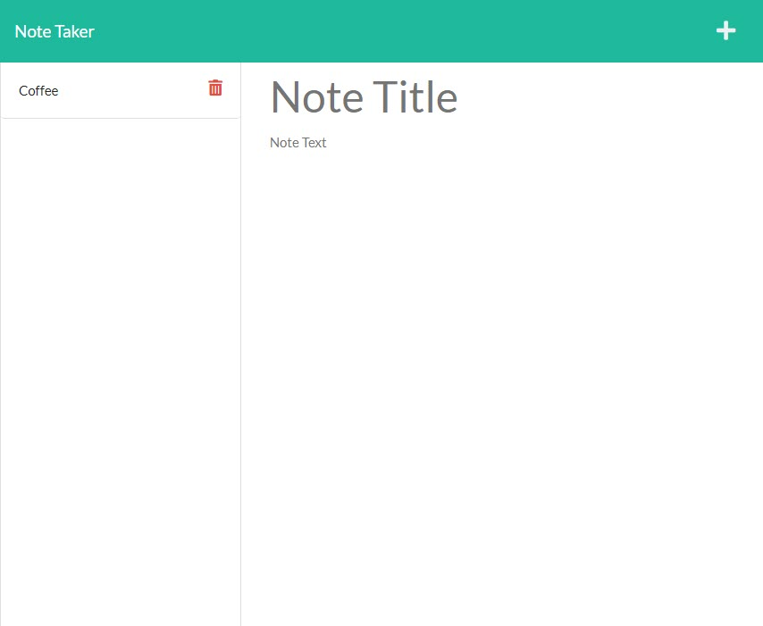

<h1 align="center">Note Taker Using Express.js</h1>
<h2 align="center">Express.js, Routing and Heroku</h2>

## Description

This application allows a user to write and save notes using an Express.js back end server and is deployed on [Heroku](https://frozen-garden-12510.herokuapp.com/).

## Table of Contents

- [Installation](#installation)
- [Usage](#usage)
- [License](#license)
- [How to Contribute](#how-to-contribute)
- [Questions](#questions)

## Installation

This application makes use of the following Node.js packages:

- [Express](https://www.npmjs.com/package/express) for the back end server
- [Uuid](https://www.npmjs.com/package/uuid) for generating unique identifiers for the notes
- [Joi](https://www.npmjs.com/package/joi) for data validation

Run `npm i` with the included `packages.json` file to install the required packages.

## Usage

After clicking the "Get Started" button, the user is presented with any existing notes that they created previously. In addition, they are provided with a template to create and save a new note.

## License

This application is covered under the MIT license. Information about this license can be found [here](http://choosealicense.com/licenses/mit/).

## How to Contribute

[MichaelHermes](https://github.com/MichaelHermes)

## Questions?

Find me on [Github](https://github.com/MichaelHermes) or email me at [mikehermes87@gmail.com](mailto:mikehermes87@gmail.com).
